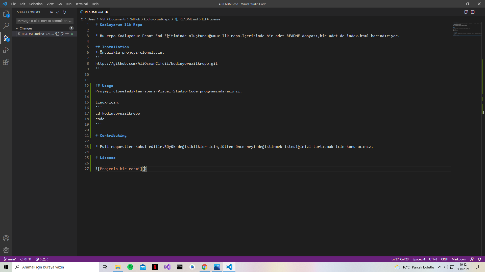

# Kodluyoruz İlk Repo

* Bu repo Kodluyoruz Front-End Eğitiminde oluşturduğumuz İlk repo.İçerisinde bir adet README dosyası,bir adet de index.html barındırıyor.

## Installation 
* Öncelikle projeyi clonelayın.
```
https://github.com/AliOsmanCifcii/kodluyoruzilkrepo.git
```


## Usage
Projeyi cloneladıktan sonra Visual Studio Code programında açınız.

Linux için:
```
cd kodluyoruzilkrepo
code .
```
# Contributing

* Pull requestler kabul edilir.Büyük değişiklikler için,lütfen önce neyi değiştirmek istediğinizi tartışmak için konu açınız.

# License

[MIT](www.google.com)

